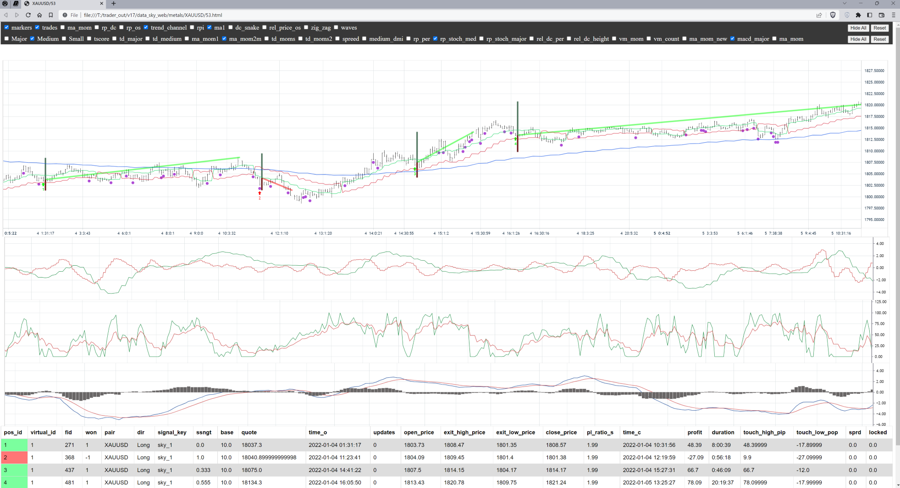

### About
An automated trader platform with full market simulation (backtest) for building smart trading bot based on technical analyse.

Screenshot of backtest output (see real demo at links below):

## Directories Structers:

- `./src/core/ta`: technical analyse indicators: MACD, Bollinger Band, CCI, Momentum, Moving averages ,... plus many custom indicators
- `./src/offline` and `/src/sim`: codes related to backtesing simulator
- `./src/online`: [cTrader](https://ctrader.com/) api in online bot mode and for data downloader. cTrader uses a low-level TCP connection with Protocol Buffer as its messaging serializer.  cTrader connection lives on its own thread. it was a little tricky to implement cTrader api as it'd docs were lacking real documentation

### Feartures and Techs
- cTrader as api prociders any more exchange or broker can be added (just 4 methods is needed for new brokers to integrate new brokers)
- simulator works like the way bot is online mode, no diffrence in the way it behave.
- very fast: one week worth of a pair can be simulated (backtested) in ~2 seconds
- many indicators
- Html output of backtested charts with many indicators in charts, trades visualization, early signals, ... (go to demo below)
- Csv outputs for feeding ML (ML is WIP)
- Multi threaded
- Candle bulding from raw ticks data of pairs.
- Suited for trading most securities: Forex, Share CFDs, Indices, Commodity, Commodity, Energy, Crypto, ...
- All parts of the platform is custom designed.

### Other:
- ML needs more works, thi is th
- Online mode needs more work for better risk management
- With one strategy it had a 27% retention (percentage of profit/wining trades) with zero spread in one strategy for Gold over six months period (price at the start and end of this six month remained the same around ~1800$) , but currently doesn't feel it's good enough to make it online
- Parameters need to be extracted, so it could work  across: Forex, Metals, Energy, Crypt, ... at the same time

### Simulator Demo
For seeing full simulator output go to [simulator_outputs](https://github.com/jozn/simulator_outputs) repo (note: using [Github large file](https://docs.github.com/en/repositories/working-with-files/managing-large-files))

For browsing html to see how trading result of simulator looks output go to [this address](http://212.46.38.249/) (note: html files is big, so be patient to load - csv files looks better at Github repo)

### Dropped features (keep codebase simple and effecive):
- Arbitrage trading over different exchanges (new focus is mostly on TA and ML)
- Dropped time based candle building, now only tick based candles used as it is a proximity of volume, charts are much less noisy in ticked candles
- Binance api: with cTrader we have access to many more different types of assets: currency, metal, energy, commodity, crypto,...
  (any exchange or broker can be added easily)
